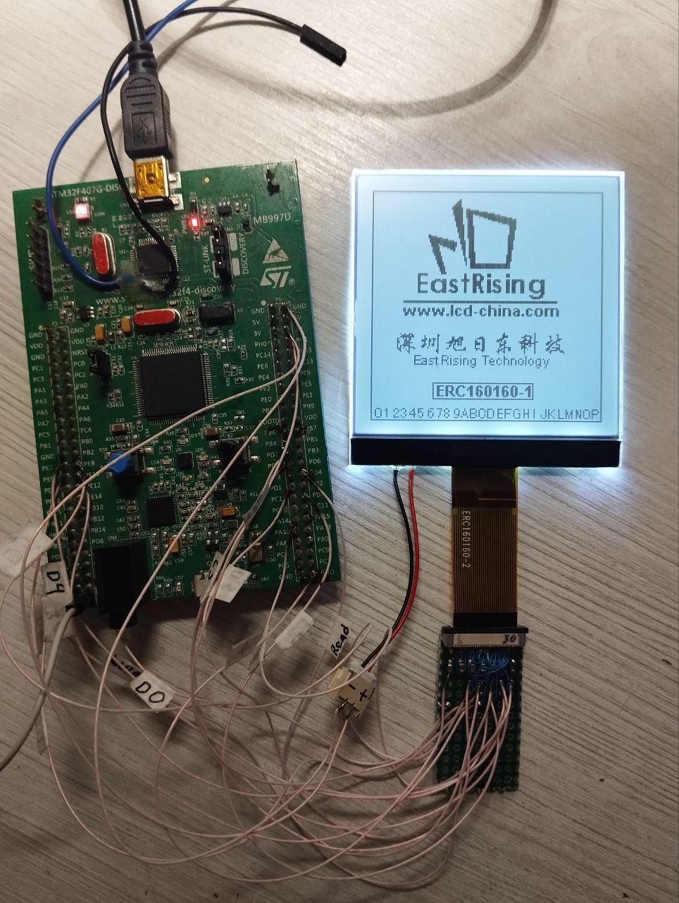

# uc1698u_160x160_F407
A working example of the ERC160160-2 display on an STM32F407VGT6

The project is compiled in the IAR ARM v9.50 environment.
The connection diagram is clear from the STM32CubeMX project.
Additional information is available in the connection diagram.
\uc1698u_160x160_F407\uc1698u-8080-master\docs\ERC160160_MCU_Interfacing.pdf

